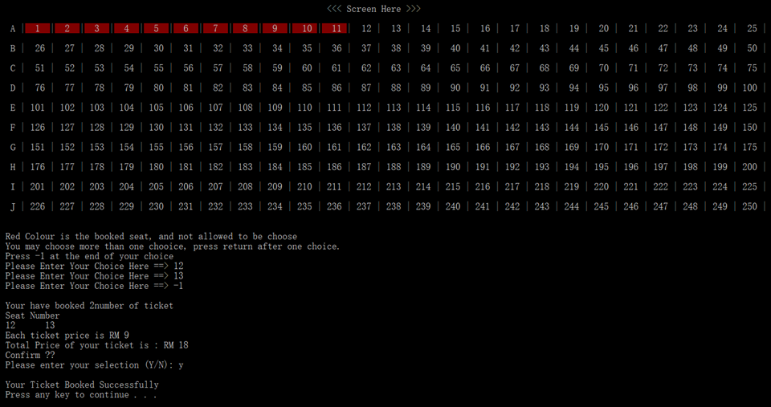
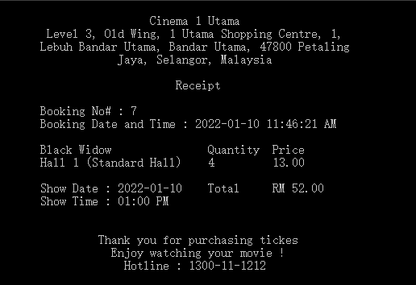

# Cinema Information System

A cinema is a organisation that provide entertainment service through the showing of films. As a business and an organisation that have many people working in it, a reliable information management system that able to deliver information accurately and efiicienly is required to maintain the flow of business. 

Other than that, the business data must be handled well to make sure only authorized staff can access and/or manipulate the data to make sure the integrity of business data. Hence, the implementation of a information management system has become neccessary in a moderm cinema business.

## Problems:

Conventional approch in cinema information management which is manual system shows difficulty in maintain and keep track of information. In the context of cinema, the problem may arise incude : 
 - Duplication of booking, 
 - Movie scheduling not up to date, 
 - Long queuing in ticket purchasing
 - Time consuming in generating report and business process
 - Business data is manipulate by nonauthorized person, etc

### ERD

## User
There are four(4) type of user in the system, you can login to the account using the following email and password.
| User | Email | Password |
| -------- | ------- | -------- |
| Customer | kaijun@cinema.com | customer! |
| Admin | jun@cinema.com | admin! | 
| Manager | low@cinema.com | manager! |
| Cashier | kaw@cinema.com | cashier! |

## User Interface
Seat Display 

Booking Receipt

## Installation:
This sytem using some library and database connector, please download these packages before building the system
 - tabulate : https://github.com/p-ranav/tabulate.git
 - json for c++ : https://github.com/nlohmann/json.git
 - Mysql C++ connector : https://dev.mysql.com/downloads/connector/cpp/

1. `Workshop SQL.sql` contain the code to build database and `TestData.sql` contain testing data for the system. Create the database and load the sample data before starting the application
2. Update the database credential in `DatabaseConnection.h`
3. Include the downloaded library in the project 
4. Build the project